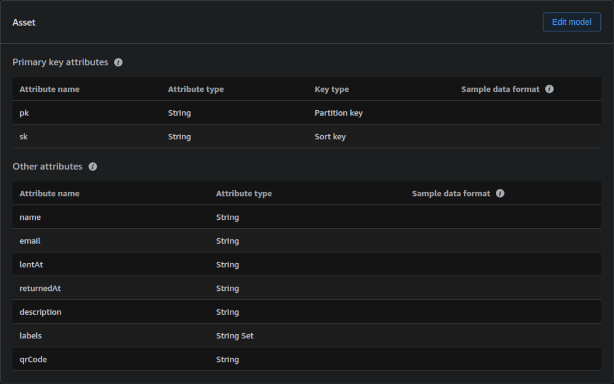

## dynamodb-playbook  
A collection of DynamoDB guides and tips.

> [What is Amazon DynamoDB?](https://docs.aws.amazon.com/amazondynamodb/latest/developerguide/Introduction.html)
>
> Amazon DynamoDB is a serverless, NoSQL, fully managed database with single-digit millisecond performance at any scale.

## When Not to Use DynamoDB

While DynamoDB is a powerful, it’s not the right fit for every use case. Here are scenarios where you might want to consider other options:

- **Unpredictable or Ad Hoc Access Patterns**: DynamoDB performs best when your access patterns are well-defined in advance. If your application requires flexible, dynamic queries: such as filtering on many different fields, full-text search, or ad hoc reporting; then, DynamoDB can become limiting or inefficient.

- **You Need Complex Relational Logic**
DynamoDB doesn't support joins like a traditional relational database. If your application depends heavily on multi-table joins or complex relational logic, a relational database may be a better fit.

- **Large Binary Objects (BLOBs)**
DynamoDB binary or blob data (like images, videos, or documents) is limited to 400KB per item.

## When to Use DynamoDB

DynamoDB shines in specific use cases where its strengths: scalability, performance, and architecture can be fully leveraged. Here are some of the best scenarios for using DynamoDB:

- **Well-Defined, High-Volume Access Patterns**: DynamoDB performs exceptionally well when your access patterns are predictable and operations are targeted by specific keys. It's ideal for applications that require low-latency lookups at scale.

- **Massive Scale with Low Latency**: DynamoDB is designed to scale horizontally and handle millions of requests per second with single-digit millisecond latency. If your app has globally distributed users and requires real-time performance, DynamoDB can handle the load without manual intervention.

- **Workloads Needing High Availability and Durability**: DynamoDB automatically replicates data across multiple Availability Zones in a region, offering built-in fault tolerance and high durability with minimal configuration. It also supports global tables for multi-region replication if you need cross-region availability.

## Core Components

The fundamental components of DynamoDB:

- **Tables**: The top-level container for data in DynamoDB. Each table stores a collection of related items.

- **Items**: Each table contains multiple items. An item is a collection of attributes and is uniquely identifiable within the table by its primary key.

- **Attributes**: Data that describes that the properties of an item.

- **Primary Key**: Every item in a table must have a unique primary key. There are two types:
  
  - **Simple Primary Key**: Consists of a single attribute, known as the *partition key* (internal physical storage).
  
  - **Composite Primary Key**: Combines two attributes: a *partition key* and a *sort key*.

    - **Partition Key**: Determines the partition (internal physical storage) where the item is stored, using a hash function.
    
    - **Sort Key**: Allows multiple items with the same partition key to be stored together and sorted by the sort key value. This enables more flexible querying based on both the partition and they sort keys.

- **Secondary Indexes**: Optional indexes that let you query data using alternate keys, beyond the primary key. Once created, a secondary index can be queried similarly to the base table, offering more flexible access patterns.

## Data Modeling

Data modeling in DynamoDB differs significantly from traditional relational databases. However, we can still use familiar relational entity diagrams to represent a business domain before translating them into a DynamoDB design.

In this playbook, we'll model a generic lending application - similar to what you'd find in a library or movie rental system - and then create the corresponding DynamoDB tables.

### Entity Diagram

Let's model our application as a classic entity relationship diagram.
```
    ┌─|Member|─────┐
    │              │
    │name          │
    │email         │
    └──────────┬───┘
               │One-to-Many
               │
               │
    ┌─|Loan|───────┐
    │              │
    │lentAt        │
    │returnedAt    │
    └──────────┬───┘
               │Many-to-One
               │
               │
    ┌─|Asset───┴──┐                ┌─|Label|────┐
    │             │ Many-to-Many   │            │
    │name         ├────────────────┤value       │
    │description  │                └────────────┘
    └──────────┬──┘
               │One-to-One
               │
               │
    ┌─|QrCode|─┴──┐
    │             │
    │value        │
    └─────────────┘
```

### DynamoDB Model

In contrast to an entity relationship model, a DynamoDB model is often designed as a single denormalized table, containing a composite primary key (partition key and sort key) and all attributes flat in a single table.

For example:

| Attribute Name | Description               |
|----------------|---------------------------|
| pk             | Partition Key             |
| sk             | Sort Key                  |
| name           | Member or Asset attribute |
| email          | Member attribute          |
| lentAt         | Loan attribute            |
| returnedAt     | Loan attribute            |
| description    | Asset attribute           |
| labels         | Label attribute           |
| qrCode         | QrCode attribute          |

Here is the table above in AWS NoSQL Workbench:



## Youtube Videos

- AWS re:Invent 2023 - Advanced data modeling with Amazon DynamoDB (DAT410)
    - https://youtu.be/PVUofrFiS_A

- AWS re:Invent 2024 - Advanced data modeling with Amazon DynamoDB (DAT404)
    - https://youtu.be/hjqrDqVaiw0

- AWS re:Invent 2020: Data modeling with Amazon DynamoDB - Part 1
    - https://youtu.be/fiP2e-g-r4g

- AWS re:Invent 2019: Data modeling with Amazon DynamoDB (CMY304)
    - https://youtu.be/DIQVJqiSUkE